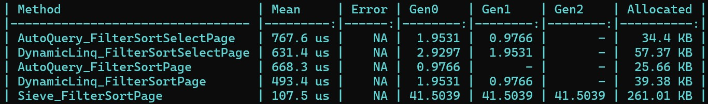

# AutoQuery

[](https://github.com/willysoft/AutoQuery/actions) [](https://github.com/willysoft/AutoQuery/actions) [](https://github.com/willysoft/AutoQuery/releases) [](https://www.nuget.org/packages/AutoQuery/)

`AutoQuery` is a powerful library for .NET that simplifies dynamic query building, filtering, and pagination using expression trees. It provides a flexible and extensible way to handle complex query scenarios. The `AutoQuery.AspNetCore` package extends this functionality with seamless integration into ASP.NET Core applications, offering middleware support and field projection capabilities.

## Features

- **Dynamic Query Building**: Generate queries dynamically using expression trees.
- **Filtering**: Apply flexible filtering logic to refine query results.
- **Field Projection**: Return only the specified fields to optimize API responses.
- **Pagination and Sorting**: Built-in support for pagination and sorting.
- **ASP.NET Core Integration**: Middleware support for easy integration into ASP.NET Core projects.

## Benchmark

The benchmark results provide an overview of `AutoQuery`'s performance in handling dynamic queries and filtering. These results can help evaluate its suitability for various application scenarios.



## Installation

### AutoQuery

Install the core library via NuGet:

```bash
dotnet add package AutoQuery
```

### AutoQuery.AspNetCore

For ASP.NET Core integration, install the extension package:

```bash
dotnet add package AutoQuery.AspNetCore
```

## Getting Started

### Using AutoQuery in .NET Applications

1. Define a query options class implementing the `IQueryOptions` interface:
    ```csharp
    public class UserQueryOptions : IQueryPagedOptions
    {
        public int[]? FilterIds { get; set; }
        public string? FilterName { get; set; }
        public string? Fields { get; set; }
        public string? Sort { get; set; }
        public int? Page { get; set; }
        public int? PageSize { get; set; }
    }
    ```
2. Configure the filter logic by implementing `IFilterQueryConfiguration`:
   ```csharp
    public class UserQueryConfiguration : IFilterQueryConfiguration<UserQueryOptions, User>
    {
        public void Configure(FilterQueryBuilder<UserQueryOptions, User> builder)
        {
            builder.Property(q => q.FilterIds, d => d.Id)
                .HasCollectionContains();
            builder.Property(q => q.FilterName, d => d.Name)
                .HasEqual();
        }
    }
    ```
3. Use `AutoQuery` to process queries:
    ```csharp
    var queryProcessor = new QueryProcessor();
    queryProcessor.ApplyConfigurationsFromAssembly(Assembly.GetExecutingAssembly());
    
    var users = new List<User>
    {
        new User(4, "Bob Brown", "bob.brown@example.com", new DateTime(1988, 12, 30)),
        new User(1, "John Doe", "john.doe@example.com", new DateTime(1990, 1, 1)),
        new User(3, "Alice Johnson", "alice.johnson@example.com", new DateTime(1992, 8, 23)),
        new User(5, "Charlie Davis", "charlie.davis@example.com", new DateTime(1995, 3, 10)),
        new User(2, "Jane Smith", "jane.smith@example.com", new DateTime(1985, 5, 15)),
    };
    
    var result = users.AsQueryable().ApplyQuery(queryProcessor, new UserQueryOptions()
    {
        Fields = "Id,Name",
        Sort = "-Id",
        FilterIds = new[] { 3, 4 },
        FilterName = "Alice Johnson"
    }).ToArray();
    
    Console.WriteLine("Filtered Users:");
    foreach (var user in result)
    {
        Console.WriteLine($"{user.Id}: {user.Name}");
    }
    ```
    4. Example Output:
    ```plaintext
    Filtered Users:
    3: Alice Johnson
    ```

### Using AutoQuery.AspNetCore in ASP.NET Core Applications

1. Define a query options class implementing the `IQueryOptions` interface:
    ```csharp
    public class UserQueryOptions : IQueryPagedOptions
    {
        [FromQuery(Name = "filter[ids]")]
        public int[]? FilterIds { get; set; }
        [FromQuery(Name = "filter[name]")]
        public string? FilterName { get; set; }
        [FromQuery(Name = "fields")]
        public string? Fields { get; set; }
        [FromQuery(Name = "sort")]
        public string? Sort { get; set; }
        [FromQuery(Name = "page")]
        public int? Page { get; set; }
        [FromQuery(Name = "pageSize")]
        public int? PageSize { get; set; }
    }
    ```
2. Configure the filter logic by implementing `IFilterQueryConfiguration`:
   ```csharp
    public class UserQueryConfiguration : IFilterQueryConfiguration<UserQueryOptions, User>
    {
        public void Configure(FilterQueryBuilder<UserQueryOptions, User> builder)
        {
            builder.Property(q => q.FilterIds, d => d.Id)
                .HasCollectionContains();
            builder.Property(q => q.FilterName, d => d.Name)
                .HasEqual();
        }
    }
    ```
3. Register the required services in `Program.cs`:
   ```csharp
    // Add AutoQuery services
    builder.Services.AddAutoQuery(Assembly.GetEntryAssembly());
    ```
4. Create a controller to handle queries:
    ```csharp
    [ApiController]
    [Route("[controller]")]
    public class UsersController : ControllerBase
    {
        private readonly IQueryProcessor _queryProcessor;
    
        private List<User> users = new List<User>
        {
            new User(4, "Bob Brown", "bob.brown@example.com", new DateTime(1988, 12, 30)),
            new User(1, "John Doe", "john.doe@example.com", new DateTime(1990, 1, 1)),
            new User(3, "Alice Johnson", "alice.johnson@example.com", new DateTime(1992, 8, 23)),
            new User(5, "Charlie Davis", "charlie.davis@example.com", new DateTime(1995, 3, 10)),
            new User(2, "Jane Smith", "jane.smith@example.com", new DateTime(1985, 5, 15)),
        };
    
        public UsersController(IQueryProcessor queryProcessor)
        {
            _queryProcessor = queryProcessor;
        }
    
        [HttpGet]
        [EnableFieldProjection]
        public IActionResult Get(UserQueryOptions queryOptions)
        {
            var result = users.AsQueryable()
                              .ApplyQueryPagedResult(_queryProcessor, queryOptions);
            return Ok(result);
        }
    }
    ```
5. Example Request:
```http
GET /Users?filter[ids]=1&filter[ids]=3&fields=Id,Name&sort=-Id&page=1&pageSize=2
```
6. Example Response:
```json
{
    "datas": [
        {
            "id": 3,
            "name": "Alice Johnson"
        },
        {
            "id": 1,
            "name": "John Doe"
        }
    ],
    "count": 2,
    "totalPages": 1,
    "page": 1
}
```

## Contribution

Contributions are welcome! Feel free to submit issues or pull requests to improve the project.

## License

This project is licensed under the [MIT License](./LICENSE).
